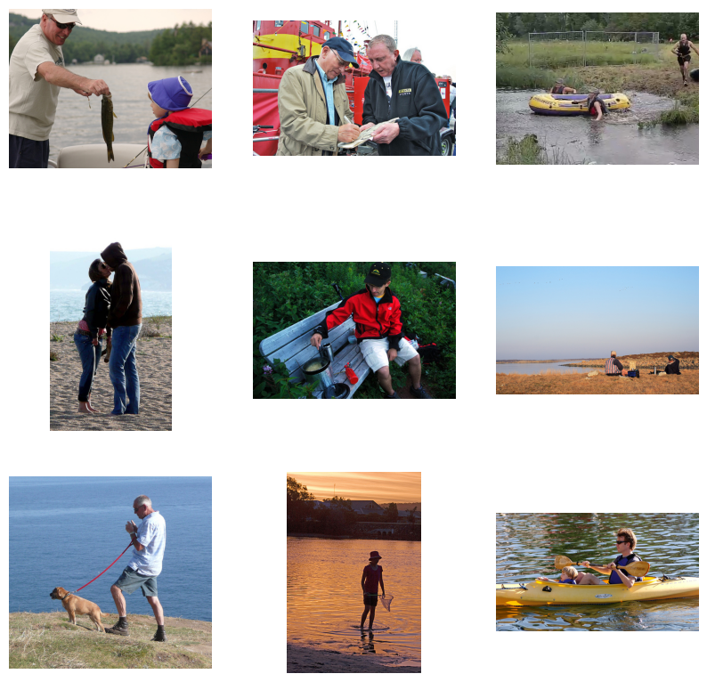

# CLIP Model Implementation with PyTorch

  

## Introduction

This project aims to implement a CLIP (Contrastive Language–Image Pretraining) model using PyTorch, inspired by OpenAI's original concept and methodologies presented in a Keras tutorial. The core innovation in this implementation is the ability of the model to understand the intricate relationship between text and images by leveraging complete sentences during training, rather than isolated classes. This approach is designed to enhance the model's adaptability and accuracy in interpreting and classifying images based on textual descriptions.

## Model Implementation

- **Framework:** PyTorch
- **Dataset:** Flickr 8k
- **Key Features:** 
  - Integration of text and image understanding
  - Advanced training techniques including image and text projection heads

## Methodology

1. **Data Preparation**
   - Utilize the Flickr 8k dataset, focusing on its varied captions to enrich the learning process.

2. **Image Encoder**
   - Implement a ResNet50 encoder using the PyTorch Image Models library (timm) to process and encode images.

3. **Text Encoder**
   - Leverage DistilBERT from HuggingFace for efficient text encoding.

4. **Training**
   - Adopt robust training methods, focusing on understanding and optimizing the model’s loss function.

5. **Evaluation**
   - Conduct thorough testing against benchmark datasets to assess the model’s classification and interpretative abilities.

## Resources

- **Dataset:** Flickr 8k
- **Libraries:** PyTorch, HuggingFace
- **Computational Resources:** Required for model training and testing

## Testing
   - Testing result for prompt "old man fishing"

## License

This project is licensed under the MIT License - see the [LICENSE.md](LICENSE.md) file for details.
